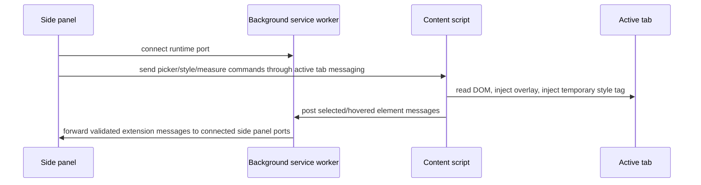

# Architecture

UI DevTools is a pnpm monorepo with browser, shared, Node CLI, and MCP packages. Browser code owns live-page interaction. Shared/core packages own stable data contracts and pure utilities. Local tools consume the same contracts without reaching into Chrome APIs.

## Packages

- `apps/extension`: Chrome MV3 extension, side panel UI, background service worker, content script, element picker, overlays, and temporary style injection.
- `apps/cli`: `ui-sync` local project utility for init, project detection, and example change-intent export.
- `apps/mcp-server`: read-only MCP stdio server for project scans, framework detection, summaries, export generation, and patch previews.
- `packages/shared`: runtime message guards, `UIChangeIntent`, `PatchSuggestion`, adapter interfaces, and shared snapshot types.
- `packages/core`: browser-independent utilities for selectors, snapshots, style diffs, contrast, box model extraction, measurements, accessibility notes, and project detection.
- `packages/adapters`: CSS and Tailwind export adapters plus explicit scaffold adapters for framework patching that is not implemented in v1.
- `packages/config`: shared TypeScript, Vitest, ESLint, and Prettier configuration.

## MV3 Message Routing

The background service worker is deliberately stateless. It keeps only a transient set of connected side panel ports for routing. Selection state, undo/redo stacks, and export data live in the side panel store or content-script session.

## Overlay And Style Isolation

The content script creates a single Shadow DOM host named `__ui-devtools-host__` for visual overlays. Overlay CSS is scoped inside the shadow root, so the inspected page does not receive extension classes or global overlay styles.

Temporary user edits are injected into one page style tag named `__ui-devtools-styles__`. The style injector rewrites rules for the current session, supports reset, and does not persist changes to the source application.

## Adapter Boundary

Adapters accept a `UIChangeIntent`. CSS and Tailwind adapters generate exports and patch previews. Framework adapters are scaffolded with explicit unsupported patch suggestions so the product never pretends to understand a source tree it cannot safely patch.

## Test Isolation

Core and adapter utilities run in Vitest without Chrome. Extension-layer tests should mock Chrome APIs at the edge and keep pure routing logic separate from runtime globals. Browser APIs are isolated to extension entrypoints and Chrome helper modules.
